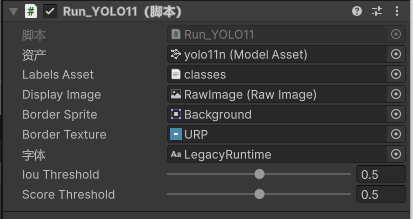
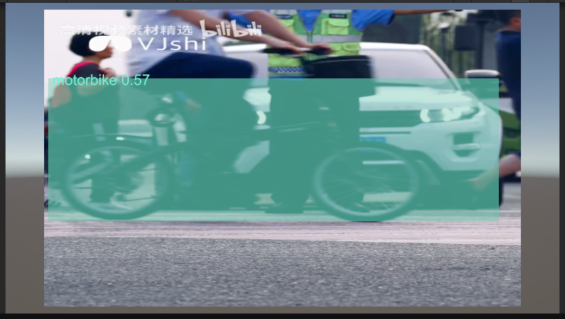
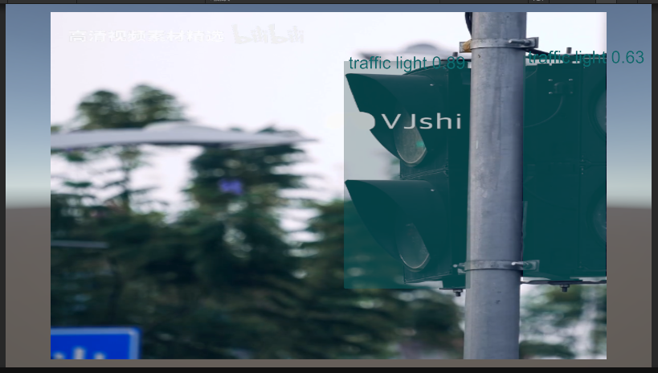

# YOLO Object Detection in Unity Using Sentis 2.1.1

## ① Introduction
This project demonstrates how to implement YOLO object detection in Unity using Sentis 2.1.1.  
It is designed for developers who need to integrate YOLO models into their game projects.

---

## ② Environment Configuration
- **Unity**: 6000.0.31f1  
- **Sentis**: 2.1.1  

---

## ③ Steps to Use
1. Create a new Unity project and install the latest version of `com.unity.sentis`.
2. Add the script `Run_YOLO11` to the `Camera`.
3. Create a new `Raw Image` for video display. You can set its size according to your needs.
4. Drag the YOLO model weights file into the `model asset field`.
5. Drag the labels file into the `labelAssets field`.
6. Prepare a video file named `video.mp4` and place it in the `StreamingAssets` folder.

** ④ Example Image Placeholder**:

---

## ⑤ Future Improvements
1. **Custom Input**: Support using the game scene as input for detection.  
2. **Enhanced Detection Boxes**: Improve the visual clarity of detection boxes.  
3. **Additional YOLO Features**: Implement other YOLO functionalities, such as image segmentation.

---

## ⑥ Preview
**Example Image Placeholder**:  

---

## ⑦ Reference
[Unity Sentis YOLOv8n Model on Hugging Face](https://huggingface.co/unity/sentis-YOLOv8n)
